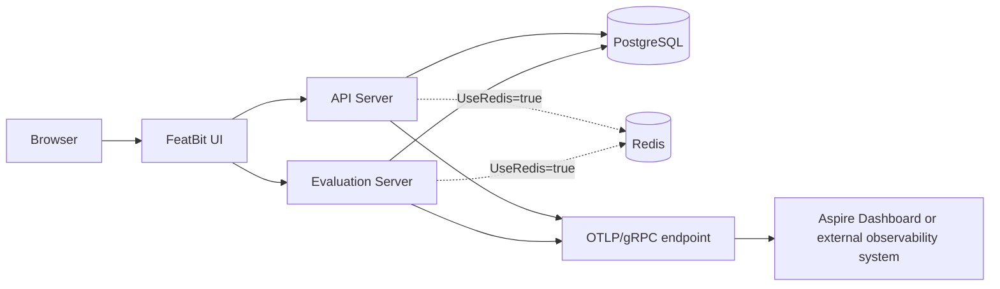

# FeatBit Aspire

| Note: The FeatBit Aspire project is currently being rebuilt. The new implementation will support FeatBit v6.0.0 and later only.

This project uses .NET Aspire 13.4 to orchestrate the official FeatBit 5.4.4 Docker images in two environments:

- Local development: Aspire creates and initializes PostgreSQL in Docker and optionally creates Redis.
- Azure: Aspire deploys three FeatBit services to Azure Container Apps while PostgreSQL, Redis, and the OpenTelemetry Collector are supplied externally.

The implementation is based on FeatBit's tagged
[`docker-compose.yml`](https://github.com/featbit/featbit/blob/5.4.4/docker-compose.yml),
[`docker-compose-standard.yml`](https://github.com/featbit/featbit/blob/5.4.4/docker-compose-standard.yml),
[`docker-compose-otel.yml`](https://github.com/featbit/featbit/blob/5.4.4/docker/composes/docker-compose-otel.yml),
and the [5.4.4 release](https://github.com/featbit/featbit/releases/tag/5.4.4), with the Data Analytics service intentionally omitted.

## Reduced core topology

FeatBit 5.4.4 does not provide a switch that replaces or disables its Data Analytics dependency. The official minimal Compose deployment includes that service. This Aspire project omits it to provide a smaller core deployment with:

- FeatBit UI and authentication
- Project, environment, segment, user, and feature-flag management
- Server-side and client-side feature-flag evaluation
- PostgreSQL messaging, or optional Redis messaging and caching

The following analytics-dependent features are unavailable because the API delegates them to Data Analytics:

- Feature-flag insights charts
- Evaluated-user statistics for a feature flag
- Experiment analytics and lifecycle operations that need to finalize an active iteration,
  including stop, archive, and starting a replacement iteration

The remaining services start and pass dependency-aware readiness checks without Data Analytics. Restoring the analytics features requires restoring `featbit/featbit-data-analytics-server:5.4.4` or supplying a compatible implementation of its HTTP API.

## Resource topology



All FeatBit images are pinned to `5.4.4`:

- `featbit/featbit-ui:5.4.4`
- `featbit/featbit-api-server:5.4.4`
- `featbit/featbit-evaluation-server:5.4.4`

## OpenTelemetry

OpenTelemetry is enabled by default for the two backend images:

| Aspire resource | OTEL service name | Runtime instrumentation |
| --- | --- | --- |
| `featbit-api` | `featbit-api` | .NET automatic instrumentation and Serilog OTLP sink |
| `featbit-evaluation` | `featbit-els` | .NET automatic instrumentation and Serilog OTLP sink |

Both backends export traces, metrics, and logs over OTLP/gRPC. The UI image is an Nginx-hosted frontend and does not include the FeatBit backend OpenTelemetry instrumentation; its container output is still available through Aspire resource logs.

In local run mode, the AppHost uses Aspire's `WithOtlpExporter` integration to inject the dashboard collector endpoint, service identity, and instance identity into every backend container. No standalone collector is required.

In Azure publish mode, the Aspire development collector is not used. The deployment instead requires a user-supplied OTLP/gRPC endpoint, such as an OpenTelemetry Collector, Grafana Alloy, or another OTLP-compatible observability service. Optional exporter headers are modeled as a secret parameter.

## Prerequisites

- .NET SDK 10
- Aspire CLI 13.4.6 or later
- Docker Desktop or another compatible container runtime
- For Azure deployment: Azure CLI and a subscription in which you can create Azure Container Apps, ACR, and related resources

Check the local toolchain:

```powershell
aspire doctor --non-interactive
```

## Run locally

Run without Redis, matching `docker-compose.yml`:

```powershell
Remove-Item Env:FeatBit__UseRedis -ErrorAction SilentlyContinue
aspire run
```

Run with Redis, matching `docker-compose-standard.yml`:

```powershell
$env:FeatBit__UseRedis = "true"
aspire run
```

`aspire start --non-interactive` can be used for a detached start. The main local endpoints match the Compose files:

| Resource | Local URL |
| --- | --- |
| UI | `http://localhost:8081` |
| API | `http://localhost:5000` |
| Evaluation Server | `http://localhost:5100` |

PostgreSQL 15.10 uses the `featbit-postgres-data` volume and runs the official FeatBit 5.4.4 SQL files from
[`infra/postgresql/docker-entrypoint-initdb.d`](infra/postgresql/docker-entrypoint-initdb.d)
in order. Local Redis is session-scoped when enabled because it contains derived cache data; FeatBit repopulates it from PostgreSQL on each Redis-enabled AppHost run. This also keeps Redis correct when switching between PostgreSQL-only and Redis modes. The initial image pull and database setup can take time.

### Inspect local telemetry

Open the dashboard URL printed by `aspire run` or `aspire start`. The dashboard contains structured logs, traces, and metrics from the API and Evaluation containers.

The Aspire CLI can also query structured telemetry:

```powershell
aspire otel logs featbit-api
aspire otel traces featbit-api
aspire otel spans featbit-api
```

Use the telemetry service name `featbit-els` to inspect Evaluation. Raw container output uses Aspire resource names instead, for example `aspire logs featbit-evaluation`.

To disable FeatBit OpenTelemetry locally:

```powershell
$env:FeatBit__OpenTelemetry__Enabled = "false"
aspire run
```

Stop the AppHost with:

```powershell
aspire stop --non-interactive
```

PostgreSQL uses a persistent container lifetime, so its authoritative FeatBit data remains after the AppHost stops. Local Redis is recreated for each AppHost session and repopulated from PostgreSQL. To reset local data completely, stop the AppHost and then remove the PostgreSQL container and `featbit-postgres-data` volume from the container runtime.

## Deploy to Azure Container Apps

Publish mode does not create or deploy PostgreSQL, Redis, or an OpenTelemetry Collector container. Prepare an external PostgreSQL server, create and initialize its `featbit` database, and prepare an OTLP/gRPC collector endpoint. The database initialization scripts are the same files used locally.

The following PowerShell example deploys with PostgreSQL, OpenTelemetry, and no Redis:

```powershell
az login

$env:Azure__SubscriptionId = "<subscription-id>"
$env:Azure__Location = "eastasia"
$env:Azure__ResourceGroup = "rg-featbit"

$env:Parameters__postgres_host = "<postgres-host>"
$env:Parameters__postgres_port = "5432"
$env:Parameters__postgres_user = "<postgres-user>"
$env:Parameters__postgres_password = "<postgres-password>"

$env:Parameters__otel_exporter_otlp_endpoint = "https://<otel-collector-host>:4317"
$env:FeatBit__OpenTelemetry__Insecure = "false"

$env:FeatBit__UseRedis = "false"
Remove-Item Env:ConnectionStrings__redis -ErrorAction SilentlyContinue

aspire deploy --environment Production
```

Do not put credentials in the OTLP endpoint. If the collector requires request metadata, enable the secret headers parameter:

```powershell
$env:FeatBit__OpenTelemetry__UseHeaders = "true"
$env:Parameters__otel_exporter_otlp_headers = "<header-name>=<header-value>"

aspire deploy --environment Production
```

The OpenTelemetry environment variables are applied to both backend Container Apps. OTLP/gRPC is fixed intentionally because it is supported by both FeatBit 5.4.4 .NET images.

To deploy with Redis, also provide a StackExchange.Redis connection string:

```powershell
$env:FeatBit__UseRedis = "true"
$env:ConnectionStrings__redis = "<redis-host>:6380,password=<password>,ssl=true"

aspire deploy --environment Production
```

FeatBit 5.4.4 writes a global `featbit:redis-is-populated` marker after copying its
derived cache from PostgreSQL. Use a dedicated Redis database/keyspace for each FeatBit
PostgreSQL database. If PostgreSQL is restored, replaced, or populated while Redis is
disconnected, clear that FeatBit Redis keyspace before restarting the services so the API
performs a complete cache backfill.

To deploy without OpenTelemetry:

```powershell
$env:FeatBit__OpenTelemetry__Enabled = "false"
Remove-Item Env:Parameters__otel_exporter_otlp_endpoint -ErrorAction SilentlyContinue
Remove-Item Env:Parameters__otel_exporter_otlp_headers -ErrorAction SilentlyContinue

aspire deploy --environment Production
```

Keep the first deployment interactive so the CLI can request Azure tenant selection when necessary. Add `--non-interactive` only after all values and the Azure login context are configured for unattended deployment. PostgreSQL passwords, Redis connection strings, optional OTLP headers, and the generated JWT key flow into container configuration as secrets and must not be committed.

The deployment model creates an Azure Container Apps environment and ACR, then deploys three Container Apps:

- External HTTPS: UI, API, and Evaluation Server
- External dependencies: PostgreSQL, optional Redis, and the OTLP collector when OpenTelemetry is enabled

Generate Bicep artifacts without creating Azure resources:

```powershell
aspire publish -o ./aspire-output --environment Production
```

Preview the deployment pipeline:

```powershell
aspire deploy --list-steps --non-interactive
```

Only destroy an environment when deletion is intended:

```powershell
aspire destroy --environment Production
```

## Configuration

| Configuration | Required when | Description |
| --- | --- | --- |
| `FeatBit__UseRedis` | Optional | Set to `true` to use Redis for messaging and caching; otherwise FeatBit uses PostgreSQL messaging with no cache. |
| `FeatBit__OpenTelemetry__Enabled` | Optional | Enables backend telemetry. Defaults to `true`. |
| `FeatBit__OpenTelemetry__Insecure` | Optional | Enables plaintext/insecure OTLP transport. Defaults to `false`; set it to `true` only for a plaintext collector endpoint. |
| `FeatBit__OpenTelemetry__UseHeaders` | Optional | Adds the secret OTLP headers parameter in publish mode. Defaults to `false`. |
| `Parameters__otel_exporter_otlp_endpoint` | Azure + OpenTelemetry | External OTLP/gRPC endpoint. Do not embed credentials. |
| `Parameters__otel_exporter_otlp_headers` | Azure + OpenTelemetry headers | Secret comma-separated OTLP exporter headers. |
| `Parameters__postgres_host` | Azure | PostgreSQL host. |
| `Parameters__postgres_port` | Azure | PostgreSQL port; defaults to `5432`. |
| `Parameters__postgres_user` | Azure | PostgreSQL user. |
| `Parameters__postgres_password` | Azure | PostgreSQL password; secret. |
| `ConnectionStrings__redis` | Azure + Redis | Redis connection string; secret. |
| `Azure__SubscriptionId` | Azure | Azure subscription ID. |
| `Azure__Location` | Azure | Azure region. |
| `Azure__ResourceGroup` | Azure | Target resource group; the deployment flow selects or creates one when omitted. |

The AppHost source is [`apphost.cs`](apphost.cs).
